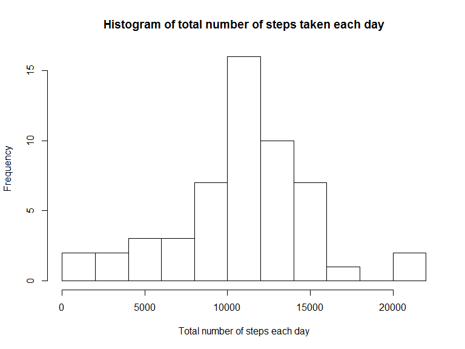
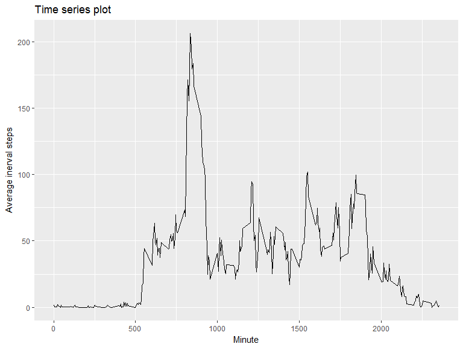
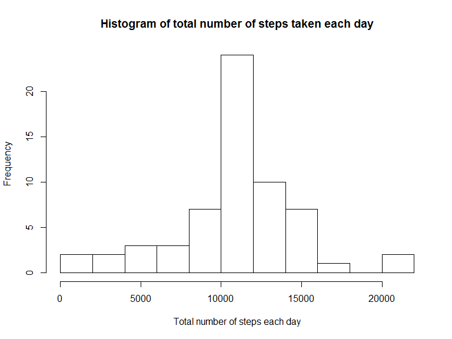
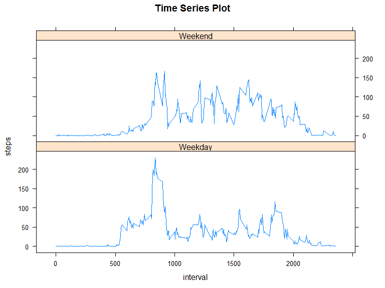

# Reproducible Research: Peer Assessment 1


## Loading and preprocessing the data
1. Load the data (i.e. read.csv())
2. Process/transform the data (if necessary) into a format suitable for your analysis


```r
library(utils)
library(RCurl)
```

```
## Loading required package: bitops
```

```r
library(lubridate)
```

```
## 
## Attaching package: 'lubridate'
```

```
## The following object is masked from 'package:base':
## 
##     date
```

```r
library(plyr)
```

```
## 
## Attaching package: 'plyr'
```

```
## The following object is masked from 'package:lubridate':
## 
##     here
```

```r
library(ggplot2)
library(lattice)

temp <- tempfile()
urlfile<-'https://d396qusza40orc.cloudfront.net/repdata%2Fdata%2Factivity.zip'
download.file(urlfile,temp, mode = "wb") # download the file.
data<-read.csv(unzip(temp)) # read unzipped  csv file
str(data)
```

```
## 'data.frame':	17568 obs. of  3 variables:
##  $ steps   : int  NA NA NA NA NA NA NA NA NA NA ...
##  $ date    : Factor w/ 61 levels "2012-10-01","2012-10-02",..: 1 1 1 1 1 1 1 1 1 1 ...
##  $ interval: int  0 5 10 15 20 25 30 35 40 45 ...
```

```r
data$date <- ymd(data$date) # convert date column into date format
```


## What is mean total number of steps taken per day?

1. Calculate the total number of steps taken per day
2. Make a histogram of the total number of steps taken each day
3. Calculate and report the mean and median of the total number of steps taken per day


```r
data2 <- data[!is.na(data$steps),] # delete missing data
head(data2)
```

```
##     steps       date interval
## 289     0 2012-10-02        0
## 290     0 2012-10-02        5
## 291     0 2012-10-02       10
## 292     0 2012-10-02       15
## 293     0 2012-10-02       20
## 294     0 2012-10-02       25
```

```r
sumS<-ddply(data2, ~date, summarize, totalSteps = sum(steps)) # 1. Calculate the total number of steps taken per day
hist(sumS$totalSteps, xlab = "Total number of steps each day", main= "Histogram of total number of steps taken each day", breaks = 10) # 2. Make a histogram of the total number of steps taken each day
```

<!-- -->

```r
print(paste0("The mean and median of the total number of steps taken per day are ", round(mean(sumS$totalSteps),0), " and ", round(median(sumS$totalSteps),0), ", respectively.")) # 3.
```

```
## [1] "The mean and median of the total number of steps taken per day are 10766 and 10765, respectively."
```


## What is the average daily activity pattern?
1. Make a time series plot (i.e. type = "l") of the 5-minute interval (x-axis) and the average number of steps taken, averaged across all days (y-axis)
2. Which 5-minute interval, on average across all the days in the dataset, contains the maximum number of steps?


```r
aveS<-ddply(data2, ~interval, summarize, totalSteps = mean(steps))  # calculate average step interval
ggplot(aveS, aes(interval, totalSteps))+geom_line()+xlab("Minute")+ ylab("Average inerval steps") + labs(title = "Time series plot") #1
```

<!-- -->

```r
indexMax <- which(aveS$totalSteps==max(aveS$totalSteps), arr.ind=TRUE)
print(paste0(aveS[indexMax,1], "th 5-minute interval contains the maximum number of steps which is ", round(aveS[indexMax,2],0))) #2
```

```
## [1] "835th 5-minute interval contains the maximum number of steps which is 206"
```


## Imputing missing values
The presence of missing days may introduce bias into some calculations or summaries of the data.  
1. Calculate and report the total number of missing values in the dataset (i.e. the total number of rows with NAs)  
2. Devise a strategy for filling in all of the missing values in the dataset. The strategy does not need to be sophisticated. 
3. Create a new dataset that is equal to the original dataset but with the missing data filled in.  
4. Make a histogram of the total number of steps taken each day and Calculate and report the mean and median total number of steps taken per day. Do these values differ from the estimates from the first part of the assignment? What is the impact of imputing missing data on the estimates of the total daily number of steps?  

```r
 # 1
print(paste0("The total number of missing values in the dataset is ", sum(is.na(data$steps)))) # number of missing values
```

```
## [1] "The total number of missing values in the dataset is 2304"
```

```r
# 2 and 3
data3<- data
for (i in seq(1,nrow(data))){
    if(is.na(data$steps[i]))   # check if the value is missing
    {
        data3$steps[i] <- aveS$totalSteps[aveS$interval == data$interval[i]] #susitute the overall mean for that 5-minute interval
    }
}
head (data3)
```

```
##       steps       date interval
## 1 1.7169811 2012-10-01        0
## 2 0.3396226 2012-10-01        5
## 3 0.1320755 2012-10-01       10
## 4 0.1509434 2012-10-01       15
## 5 0.0754717 2012-10-01       20
## 6 2.0943396 2012-10-01       25
```

```r
#4
sumS2<-ddply(data3, ~date, summarize, totalSteps = sum(steps)) # Calculate the total number of steps taken per day with filled dataset
hist(sumS2$totalSteps, xlab = "Total number of steps each day", main= "Histogram of total number of steps taken each day", breaks = 10) # 4. Make a histogram of the total number of steps taken each day
```

<!-- -->

```r
print(paste0("The mean and median of the total number of steps taken per day are ", round(mean(sumS2$totalSteps),0), " and ", round(median(sumS2$totalSteps),0), ", respectively.", " The average value is the same as before imputing, and the median is 10766 steps increased by 1 step.")) 
```

```
## [1] "The mean and median of the total number of steps taken per day are 10766 and 10766, respectively. The average value is the same as before imputing, and the median is 10766 steps increased by 1 step."
```


## Are there differences in activity patterns between weekdays and weekends?
1. Create a new factor variable in the dataset with two levels - "weekday" and "weekend" indicating whether a given date is a weekday or weekend day.  
2. Make a panel plot containing a time series plot of the 5-minute interval and the average number of steps taken, averaged across all weekday days or weekend days (y-axis). 

```r
data3$weekday <- weekdays(data3$date) # conver date to weekday
data3$weekday[data3$weekday  == "Saturday"|data3$weekday  =="Sunday" ] <-"Weekend" # 1 new factor for weekend
data3$weekday[data3$weekday  == "Monday" | data3$weekday  =="Tuesday" | data3$weekday  =="Wednesday"| data3$weekday  =="Thursday"| data3$weekday  =="Friday" ] <-"Weekday" # 1 new factor for weekday
data3$weekday <- factor(data3$weekday) # 1 convert to factors
head(data3)
```

```
##       steps       date interval weekday
## 1 1.7169811 2012-10-01        0 Weekday
## 2 0.3396226 2012-10-01        5 Weekday
## 3 0.1320755 2012-10-01       10 Weekday
## 4 0.1509434 2012-10-01       15 Weekday
## 5 0.0754717 2012-10-01       20 Weekday
## 6 2.0943396 2012-10-01       25 Weekday
```

```r
aveS2<-ddply(data3, ~interval+weekday, summarize, steps = mean(steps))  # calculate the average of each interval for weekend or weekday
xyplot(steps~interval|weekday, data=aveS2, type="l", main = "Time Series Plot",layout=c(1,2)) # 2. Make a panel plot
```

<!-- -->

```r
print("People make more steps druing the weekends.")
```

```
## [1] "People make more steps druing the weekends."
```
